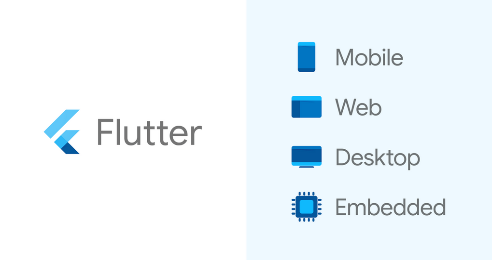
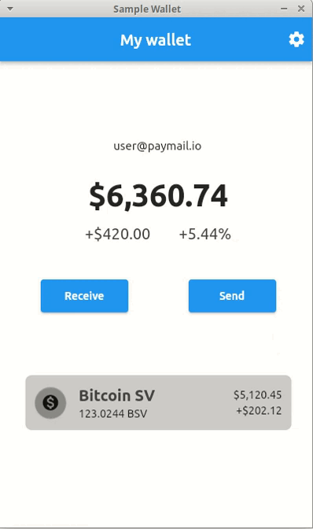
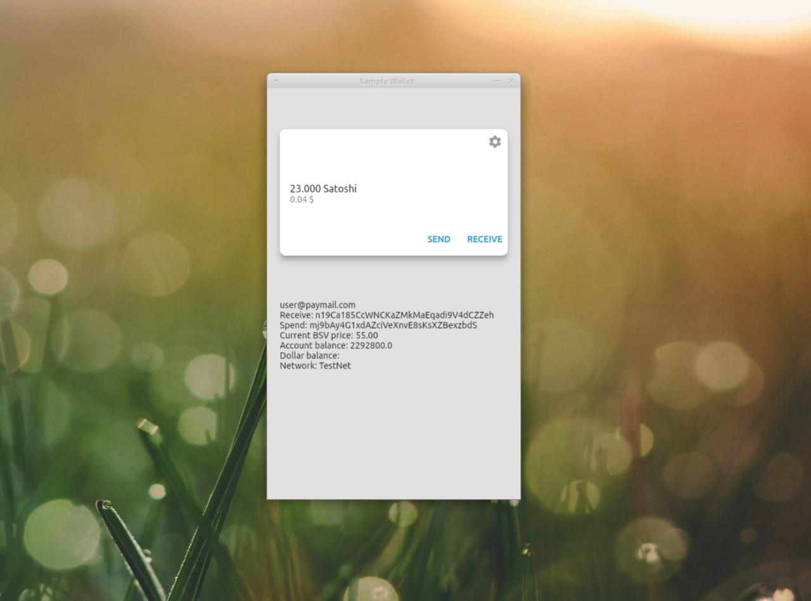
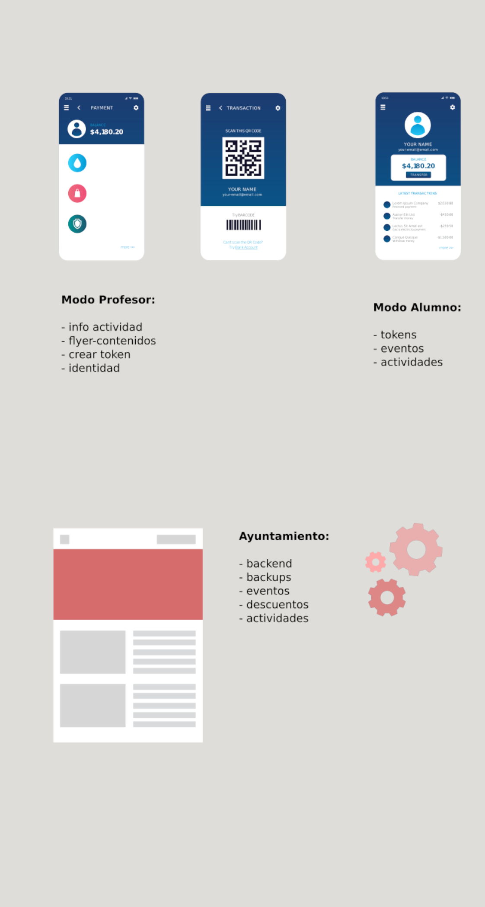

+++
author = "Hugo Authors"
title = "Nacho Mondine"
description = "Flutter/Dart and BSV"
categories = [
    "Flutter",
    "Web3" ,
    "BSV"
]
tags = [
    "dev",
]
image = "wallet.jpg"
weight = 2
+++

## Cross-platform BSV development

   

  




