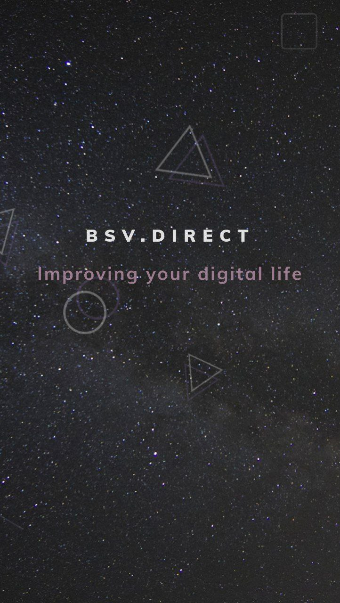
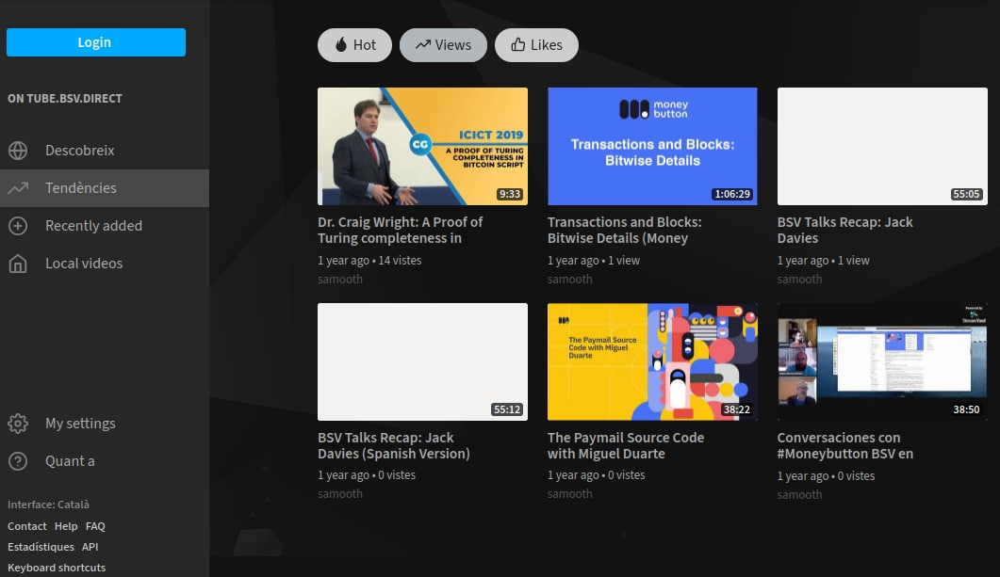
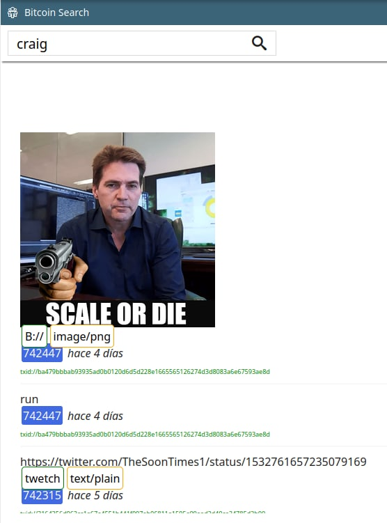

+++
author = "Hugo Authors"
title = "Tomás Nomas"
description = "Searching de BSV Blockchain"
categories = [
    "Bitcoin",
    "Web3" 
]
tags = [
    "search",
]
image = "search.png"
weight = 3
+++

## www.bsv.direct

Algú recorda els allotjaments de pàgines gratuïts?

Bitcoin marca un abans i un després a l'obsolescència programada de les dades. Bitcoin és un nou llibre d'història que crea les bases sòlides per a un multivers.

Els motors de cerca són una eina bàsica i fonamental a l'actual Internet i no podien ser menys importants a Metanet.
A BSV.Direct, estem creant en un motor de cerca que permeti a la gent tenir una perspectiva més clara del contingut a la blockchain i que els permetrà afegir i accedir a resultats de qualitat amb dades perdurables

   

     




